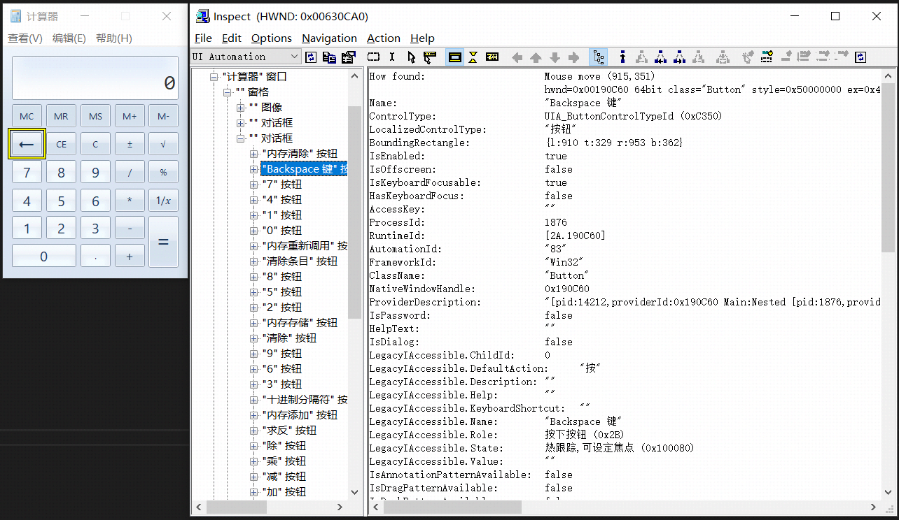
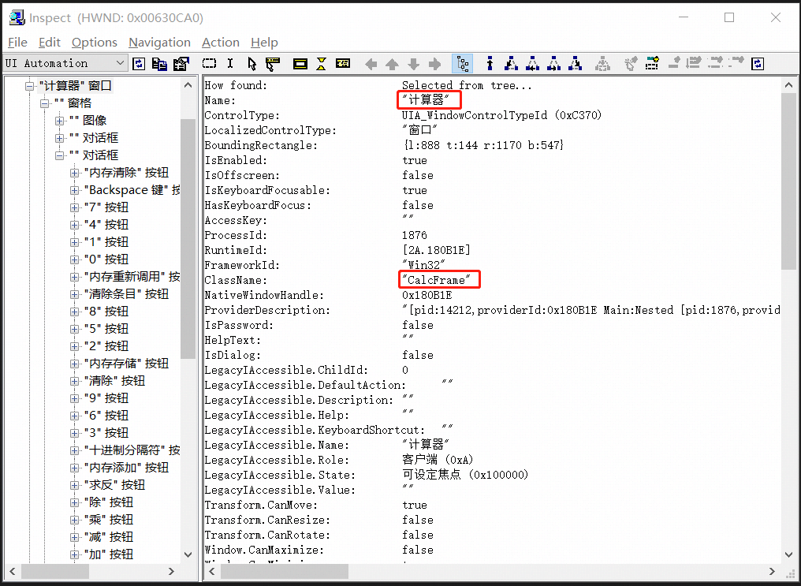
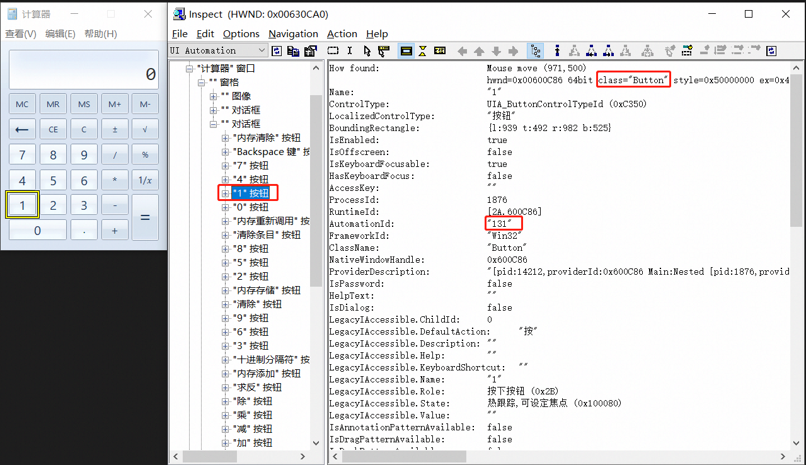
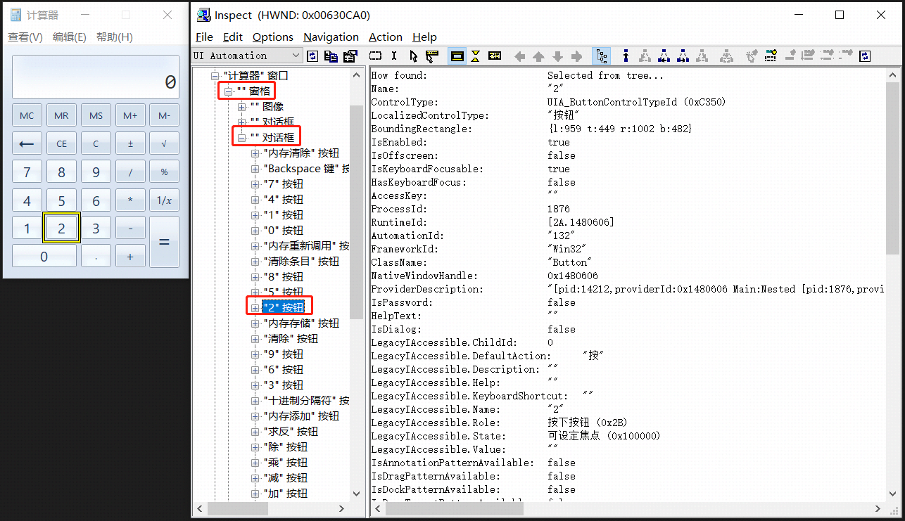

.. include:: ./links/link.ref

.. _ui_locator:

定位UI元素
==========

在QT4C中，UI元素的主要类型分为Window和Control两种类型。对于UI元素，不管是Window或者是Control，定位都主要是依靠QPath来进行定位的，QT4C需要用QPath来标识每一个元素。这里以系统自带的计算器为例，举一个简单的使用QPath封装控件的例子::

    import qt4c.wincontrols as win
    self.updateLocator({
        '回退键': {
            'type': win.Control,
            'root': self,
            'locator': QPath("/ClassName='CalcFrame' && Text='计算器' && Visible='True' /ClassName='Button' && MaxDepth='3' && Instance='1'")
        }
    })，

可以看到QT4C中定位UI元素需要type，root和locator属性。

* type: 指定控件的类型，和Windows中定义的控件类型相对应，如Control，TextBox，ComboBox等等。

* root: 指定控件的父节点，指定父节点后，查找控件时，会先找到父节点，然后以父节点为根节点，从根节点开始查找目标控件，这对于你定义的QPath找到多个的情况非常有用，如果指定了父节点，就只会返回父节点下的节点，否则找到多个重复节点就会报错。 如果指定为self，则表示会从整颗控件树根节点开始查找目标控件。

* locator：控件封装的定位器，通常传入字符串类型或QPath对象。

QT4C定位UI元素主要依靠的就是locator属性，可以传入单独的字符串或者一个QPath对象。如果传入的是字符串类型的值，则默认在全局对Name属性为指定的字符串的控件进行查找。更多对于QPath语法的学习请先参考《|qtaf-qpath|_》。

===================
使用Inspect获取控件
===================

Inspect是一种Win32应用控件抓取工具，你可以使用微软提供的Inspect.exe来获取控件，关于微软的Inspect.exe的使用，可参考《|inspect-usage|_》。

.. note::

   UIA控件使用微软提供的Inspect.exe工具中的UI Automation模式进行抓取。

打开系统自带的计算器后，打开Inspect控件抓取工具(这里以Inspect.exe为例)，开始探测控件树，得到界面如下:

上面封装的控件就是上图黄框中计算器中的回退键。使用Inspect控件抓取工具可以遍历计算器的控件树，同时可以看到某一个UI元素的属性值。获取到控件属性之后，你就可以通过这些属性值来设计QPath来定位UI元素了。

=================
使用QPath封装控件
=================

下面通过Inspect工具看一下计算机主界面的属性，然后对主界面进行封装：

上面标识出来的ClassName、Text(Name), 以及ControlId(AutomationId)、Visible等都是比较常见的可以用于封装QPath的属性。不止Control类的封装需要使用QPath，Window类的封装也是需要QPath的。首先封装一个Window类::

    import qt4c.wincontrols as win
    from qt4c.qpath import QPath

    class MainPanel(win.Window):
        def __init__(self):
            qp = QPath("/ClassName='CalcFrame' && Text='计算器' && Visible='True'")
            super(MainPanel, self).__init__(locator=qp)

这里没有传入root参数，那么默认以桌面作为根节点进行查找，通过ClassName、Text和Visible属性，就可以定位到计算器的主页面了，但是需要注意的是，同样的窗口的ControlId(AnimationId)有时候不一定会是一样的，所以使用ControlId进行控件的封装时需要确认ControlId是否不会发生变化。

接下来我们使用QPath来定位计算器主界面中的几个按钮::

    import qt4c.wincontrols as win
    from qt4c.qpath import QPath

    class MainPanel(win.Window):
        def __init__(self):
            qp = QPath("/ClassName='CalcFrame' && Text='计算器' && Visible='True'")
            super(MainPanel, self).__init__(locator=qp)

            locators = {
                '按键1': {
                    'type': win.Control,
                    'root': self,
                    'locator': QPath("/ClassName='Button' && MaxDepth='3' && ControlId='0x83'")},
                '按键2': {
                    'type': win.Control,
                    'root': self,
                    'locator': QPath("/ClassName='CalcFrame' /ClassName='#32770' && Instance='1' /ClassName='Button' && Instance='10'")
                }
            }

            self.updateLocator(locators)

以“按键1”为例，这是QPath::

    '按键1': {
        'type': win.Control,
        'root': self,
        'locator': QPath("/ClassName='Button' && MaxDepth='3' && ControlId='0x83'")
    }

这里以主界面作为根节点进行查找，在Inspect中可以看到，该控件是在以主界面为根节点深度为3的位置，所以可以直接设定MaxDepth=3，但是发现与该控件同一级的出现了多个Button，只从ClassName属性是无法准确定位到“按键1”的。不过通过打开多个计算器窗口进行控件抓取发现这些按钮控件的ControlId是不会发生变化的，因此可以利用ControlId来进行唯一定位。

那如果恰好你需要定位的控件的ControlId并非唯一确定的呢？这个时候你就需要使用“按键2”的定位方法::

    '按键2': {
        'type': win.Control,
        'root': self,
        'locator': QPath("/ClassName='CalcFrame' /ClassName='#32770' && Instance='1' /ClassName='Button' && Instance='10'")
    }

首先以主窗口为根节点，编写多个QPath依次定位到其子孙节点，其中当定位到第二层的控件的时候，因为同一层出现了多个ClassName为“#32770”的控件，可以通过图中红框所示来确定控件在该层的位置，然后使用Instance来确定需要的控件，最后定位到“按键2”也是同理,这样子就可以避免了ControlId不唯一导致无法准确定位控件的情况了。

通过类似的方法，你就可以一一封装计算器主界面中的所有按键了。

=================
QT4C常用QPath属性
=================

--------------
控件的常用属性
--------------

^^^^^^^^^^^^^^
ClassName属性
^^^^^^^^^^^^^^

ClassName是QT4C中定位控件比较常用的一个属性，通过Inspect工具就可以获取到控件的ClassName属性，但是该属性一般不唯一，通常需要搭配其他属性进行使用。

此外，该属性大多数情况下还可以作为type属性选择的一个重要参考，除了最基础的Control类型，QT4C还提供了TextBox、ListView、ComboBox等控件类型，具体请参考接口文档进行使用。

^^^^^^^^^^^^^^
ControlId属性
^^^^^^^^^^^^^^

该属性是控件的唯一标识，一般优先考虑使用ControlId进行定位，但并不是所有控件都存在ControlId属性，当控件不存在ControlId属性时，则需要使用其他属性进行定位。

.. warning:: 在不同Inspect工具中，ControlId的命名各不相同，请根据实际情况在Inspect中获取对应的ControlId。

^^^^^^^^^^
Text属性
^^^^^^^^^^

Text属性在Text类控件出现比较多，当不存在ControlId且Text属性不为空时，可以使用Text属性进行定位。

^^^^^^^^^^^^^^
Visible属性
^^^^^^^^^^^^^^

每个控件都有Visible属性，该属性常用于同时存在多个控件时，定位当前可见的控件。

---------------
QPath的特殊属性
---------------

^^^^^^^^^^^^
UIType属性
^^^^^^^^^^^^

在QT4C中出现有多种控件类型，包括Win32控件、UIA控件和html控件，当UIType没有指定时默认取值为父节点的值。有时候使用UIType也可以高效辅助进行控件的定位。

^^^^^^^^^^^^^^
MaxDepth属性
^^^^^^^^^^^^^^

有时你需要定义跨层的控件，例如M层定义后，接下来要定义第N层(M-N>1)的控件，但是如果一层一层定义下来比较费事，就可以借助MaxDepth，就会搜索M层下的N层内的所有控件。使用可参考上面控件“按键1”的封装和《|qtaf-qpath|_》。

^^^^^^^^^^^^^^
Instance属性
^^^^^^^^^^^^^^

有时候我们需要定位的控件没有可以用来直接定位的属性，那么你可以使用Instance属性，该属性可以在当前QPath定位到的多个控件中定位到你需要的第n个控件。如果没有明确指定时默认取值为'1'，即直接父子关系。具体使用可参考上面控件“按键2”的封装和《|qtaf-qpath|_》。

---------
正则匹配
---------

在上面的例子中，我们都是用全匹配的方式，即在QPath中都是用"="，如果要定义的内容有部分是变化的，可以考虑用正则匹配的方式，例如上面提到的“按键2”控件，如果前后有可能有别的变化的内容，可如下定义::

   '按键2': {
        'type': win.Control,
        'root': self,
        'locator': QPath("/ClassName~='Calc.*' /ClassName='#32770' && Instance='1' /ClassName='Button' && Instance='10'")
    }
   
.. note:: 从上面可以看出，同一个控件是可以有多种写法的，所以定义时应该选择最简洁的写法，不要不必要地复杂化。当需要多个字段辅助定义才能定位一个控件时，才进行结合使用。