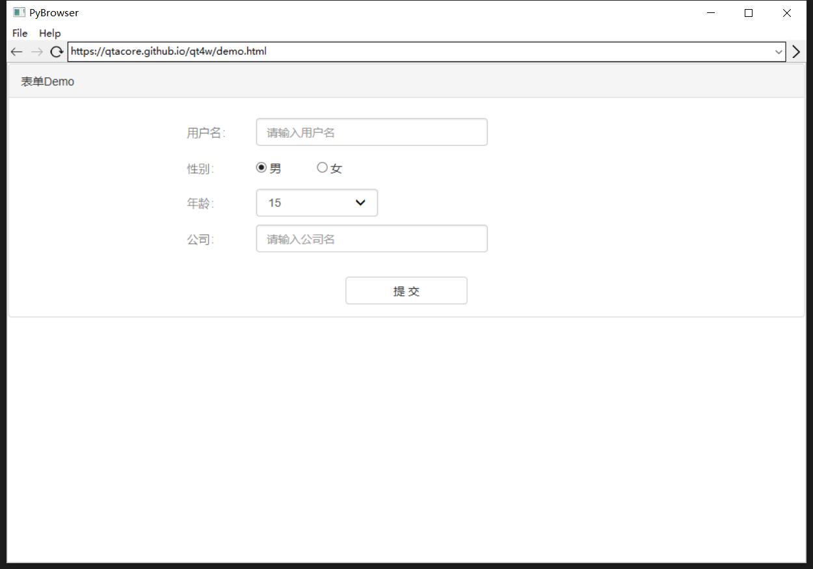
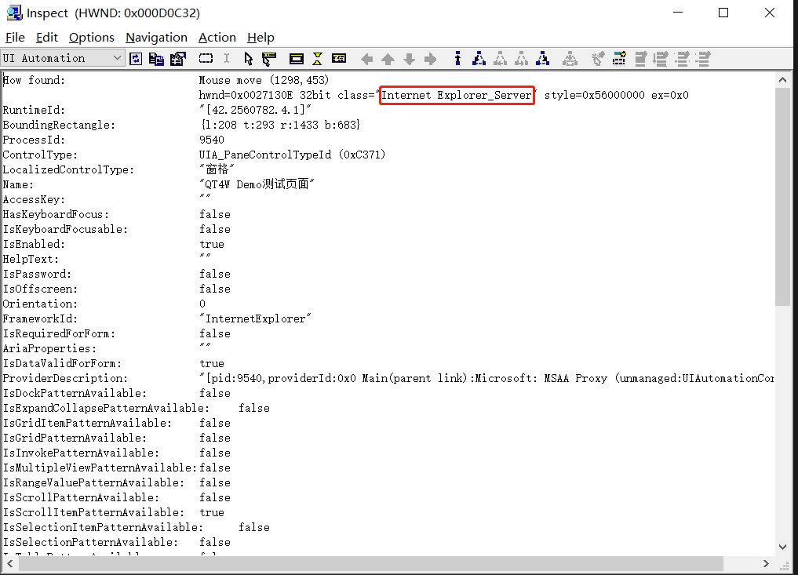

.. include:: ./links/link.ref

Web自动化测试支持
==================

QT4C的Web自动化测试依赖QT4W，关于Web自动化测试的相关内容，使用前请先参考《|qt4w-homepage|_》熟悉QT4W的基础知识。

在使用QT4C进行Web自动化测试，你需要先安装QT4W::

    pip install qt4w

在QT4C中提供了对Web自动化测试的支持，并且封装了cef3webview、chromewebview、iewebview和tbswebview四种webview：

==============   ===========================   ====================
webview类型       支持Web页面类型                     实现方式
==============   ===========================   ====================
iewebview         IE浏览器页面以及IE内嵌页面      通过JS注入
chromewebview     Chrome浏览器页面               远程调试
cef3webview       cef3内嵌页面                  通过JS注入
tbswebview        tbs内嵌页面                   远程调试
==============   ===========================   ====================

在Web自动化测试中，你需要对WebPage和WebElement进行封装。在QT4C中提供了两种封装方式：

    * 使用webview基类进行Webview的封装，封装内嵌页面标识

    * 使用浏览器Browser类来打开浏览器窗口，封装基础页面标识

=======================
Web内嵌页面的自动化测试
=======================

QT4C还提供了对Web内嵌页面的支持，这里以一个简单的Demo应用程序PyBrowser为例，这是一个简单的输入url访问对应网站的应用程序，其中包含了一个IE内嵌页面:

首先参考《:ref:`app_struct`》对Demo应用程序封装一个简单的App类::

    # -*- coding: utf-8 -*-
    from qt4c.app import App
    import subprocess, time

    class PyBrowserApp(App):
        '''DemoWeb App
        '''

        def __init__(self):
            App.__init__(self)
            self._process = subprocess.Popen('C:\\Users\\qta\\Desktop\\pyBrowser.exe')

        @property
        def ProcessId(self):
            return self._process.pid

        def quit(self):
            self._process.kill()
            from qt4c.util import Process
            for i in Process.GetProcessesByName('pyBrowser.exe'):
                i.terminate()
            App.quit(self) 

接下来以QT4W示例页面为例，使用Inspect获取该窗口的控件树，对Web页面进行封装。

-------------
封装webview
-------------

webview相当于一个内嵌页面的容器控件，如果你想要对内嵌Web页面进行封装的话，你必须先对容器进行封装。

根据不同内嵌页面，你可以选择不同的webview进行封装。因为Demo应用程序的内嵌页面属于IE内嵌页面，因此可以使用iewebview来进行封装，参考如下::

    from qt4c.webview.iewebview import IEWebView
    from qt4c import wincontrols

    class Webkit(IEWebView):
        '''用于展示内嵌Web页面的容器控件
        '''

        def __init__(self, locator):
            self._win = wincontrols.Control(locator=locator)
            super(Webkit, self).__init__(self._win)

--------------------
WebPage的封装和使用
--------------------

WebPage一般对应一个Web页面，它里面包含多个Web控件元素。QT4C继承了QT4W的WebPage的实现，封装了PC端自动化所需的页面相关逻辑。在封装某个页面的WebPage时，一般会直接继承QT4C的WebPage的实现。

首先以一个实例介绍如何封装一个Web控件，参考如下::

    'controlname':{
        'type': WebElement,
        'locator': XPath('//div[@id="controlid"]'),
    }

封装一个Web控件需要控件名，而type用来指示控件的类型，locator传入的是XPath对象，用于定位控件。关于XPath的详细内容可参考《|qt4w-homepage|_》。

至于更多的控件类型如容器类控件标识、容器类控件标识等请参考《|qt4w-webelement|_》进行使用。

当webview封装完成之后，就可以使用封装好的webview来对需要进行测试的Web页面进行封装，这里需要通过Inspct工具获取内嵌页面的容器的控件属性：

获取到控件属性之后，编写对应的QPath，实例化一个Control对象作为我们所封装的WebPage的容器控件::

    from qt4c.webcontrols import WebPage, WebElement, XPath
    from qt4c.qpath import QPath

    class BrowserPage(WebPage):
        '''Demo页面
        '''
        def __init__(self, locator):
            qp = QPath("/ClassName='wxWindowNR' && Text='PyBrowser' && Visible='True' /ClassName='Internet Explorer_Server' && MaxDepth='4'")
            self._win = Webkit(locator=qp)
            WebPage.__init__(self, self._win)
            ui_map = {
                'title': XPath('//div[@class="panel-heading"]'),
                'name': {'type': InputElement, 'locator': XPath('//input[@id="name"]')},
                'female': XPath('//input[@value="female"]'),
                'male': XPath('//input[@value="male"]'),
                'age': {'type': SelectElement, 'locator': XPath('//select[@id="age"]')},
                'company': {'type': InputElement, 'locator': XPath('//input[@id="company"]')},
                'submit': XPath('//button[@id="submit"]'),
            }

            self.update_ui_map(ui_map)

        def set_name(self, name):
            '''设置姓名
            '''
            self.control('name').value = name

        def set_female(self):
            '''设置性别为女性
            '''
            self.control('female').click()

        def set_male(self):
            '''设置性别为男性
            '''
            self.control('male').click()

        def set_age(self, age):
            '''设置年龄
            '''
            self.control('age').selection = age

        def set_company(self, company):
            '''设置公司名
            '''
            self.control('company').value = company

        def submit(self):
            '''提交
            '''
            self.control("submit").click()

初始化BrowserPage对象之后，就可以参考上面Browser类的介绍使用封装好的WebPage对Web页面进行操作了::

    pybrowserApp = PyBrowserApp()
    pybrowserEmbedPage = BrowserPage(pybrowserApp)
    pybrowserEmbedPage.set_name('qta')

这里进行的操作是，在应用程序的内嵌页面中设置名称为“qta”。

=============================
使用Browser类封装基础页面标识
=============================

在QT4C中封装了对Chrome、IE浏览器的支持，你可以通过调用qt4w的Browser类来进行使用。要想使用Browser类来封装web基础页面标识，你同样需要对WebPage和Webelement进行封装。

----------------------
WebPage的封装和使用
----------------------

根据《|qt4w-usage|_》中的demo范例，我们封装一个WebPage::

    from qt4c.webcontrols import XPath
    from qt4c.webcontrols import WebPage, WebElement

    class DemoPage(WebPage):
        '''登录页面
        '''
        ui_map = {
            'title': XPath('//div[@class="panel-heading"]'),
            'name': {'type': InputElement, 'locator': XPath('//input[@id="name"]')},
            'female': XPath('//input[@value="female"]'),
            'male': XPath('//input[@value="male"]'),
            'age': {'type': SelectElement, 'locator': XPath('//select[@id="age"]')},
            'company': {'type': InputElement, 'locator': XPath('//input[@id="company"]')},
            'submit': XPath('//button[@id="submit"]'),
        }
                
        def set_name(self, name):
            '''设置姓名
            '''
            self.control('name').value = name

        def set_female(self):
            '''设置性别为女性
            '''
            self.control('female').click()

        def set_male(self):
            '''设置性别为男性
            '''
            self.control('male').click()

        def set_age(self, age):
            '''设置年龄
            '''
            self.control('age').selection = age

        def set_company(self, company):
            '''设置公司名
            '''
            self.control('company').value = company

        def submit(self):
            '''提交
            '''
            self.control("submit").click()

接下来，就可以调用Browser类来打开一个Web页面，直接获取一个指定的WebPage对象::

    from demolib.demopage import DemoPage
    from qt4w.browser import Browser
    
    Browser.register_browser('Chrome', 'browser.chrome.ChromeBrowser')
    browser = Browser("Chrome")         #指定浏览器
    page = browser.open_url('https://qtacore.github.io/qt4w/demo.html', DemoPage)   #打开网页，返回指定的WebPage页
    page.set_name('qta')

这里需要指出的是，在使用Browser("browsername")获取浏览器对象时，需要先使用register_browser()注册一下，才能使用，此处注册一次即可，具体用法参考《|qt4w-usebrowser|_》。

除了自定义的方法，QT4W还提供了对以下操作的支持：

    1、基本属性的定义及操作，包括页面的URl、Title、ReadyState、cookie等

    2、页面滑动操作

    3、查找元素：find_element和find_elements

    4、其他操作：执行JS接口（eval_script）、激活窗口activate()以及upload_file()等

此外，关于Browser类的更多接口，请参考 :ref:`browser_package` 对应的浏览器类型进行使用。
